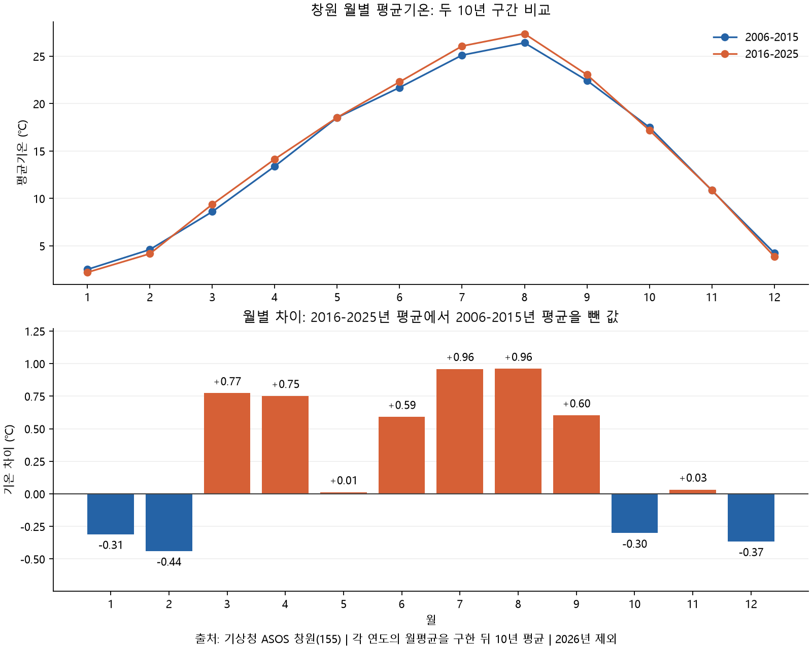
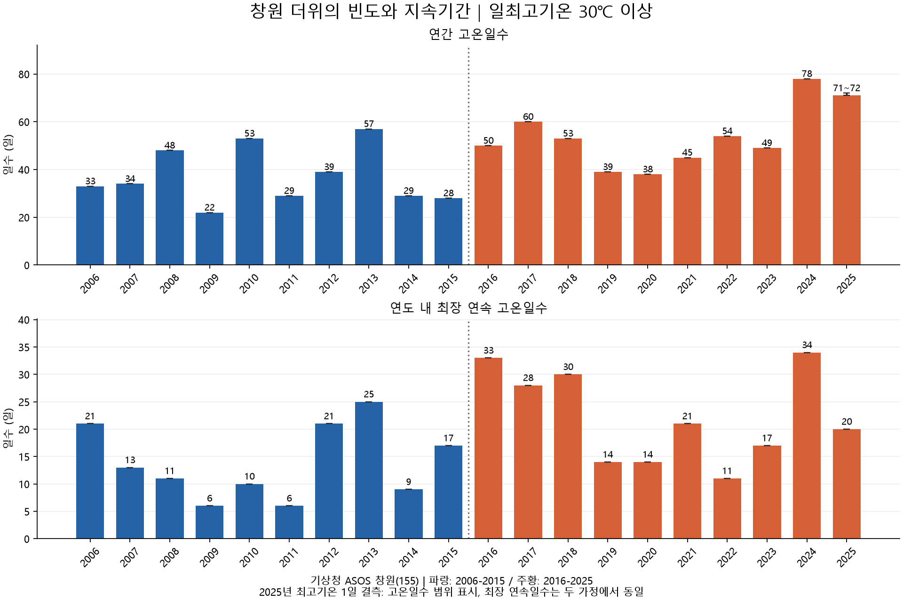
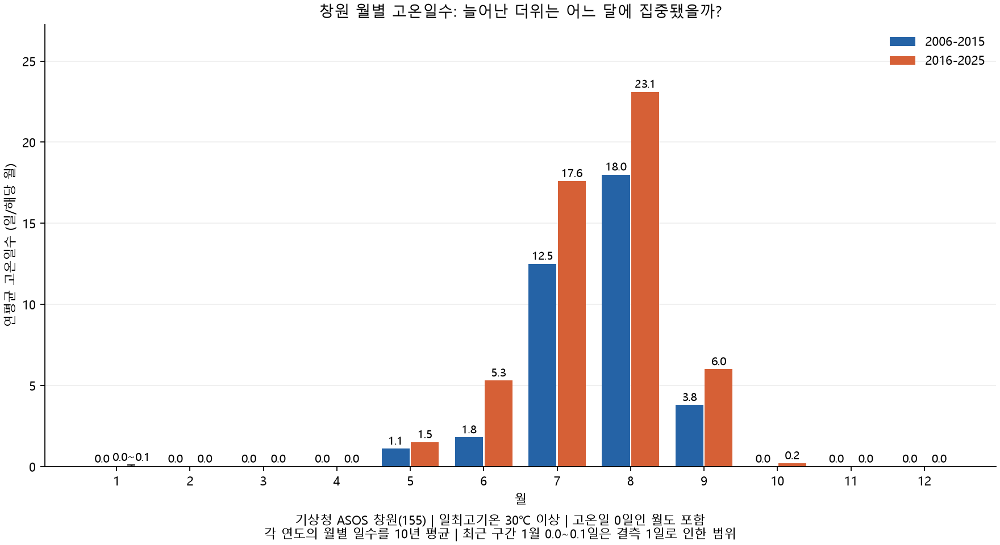
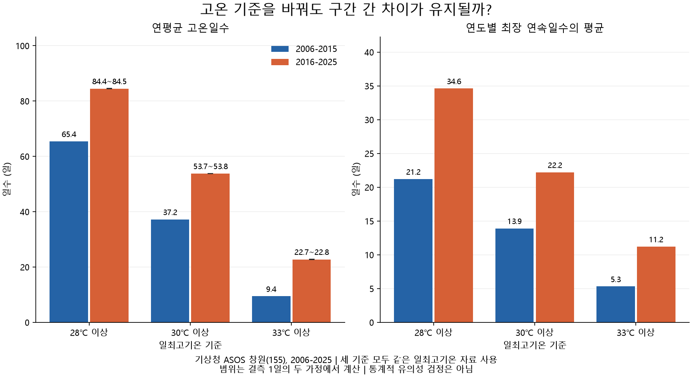
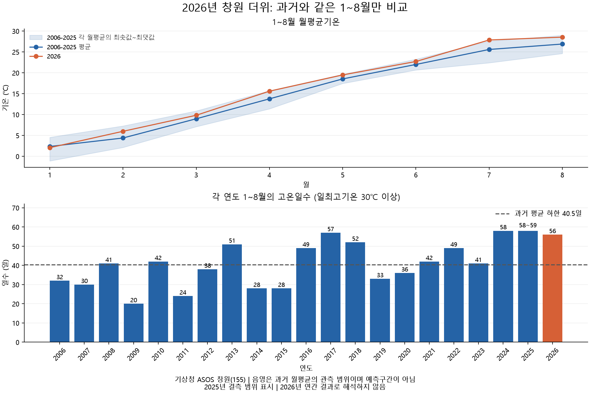
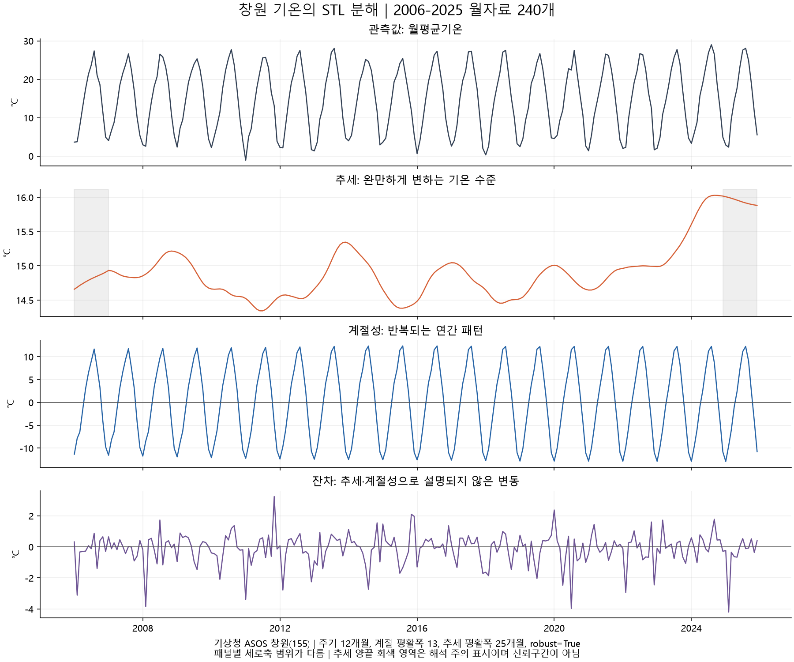
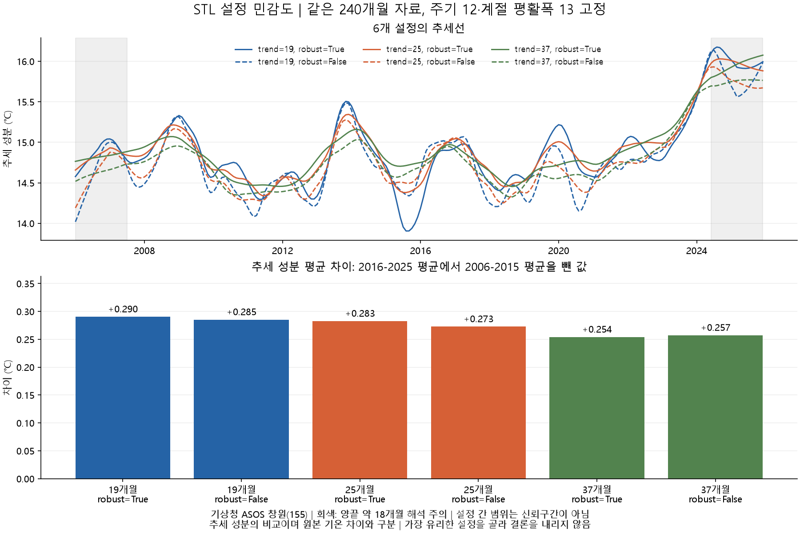

# 창원의 더위 변화 분석 리포트

분석 기준: 창원 관측소(155), 본 분석 2006~2025년, 추가 비교 2026년 1~8월.

## 1. 주제와 분석 질문

창원에서 경험하는 더위의 변화가 관측자료에서도 나타나는지 확인한다.

1. 2006~2015년과 2016~2025년의 월별 평균기온은 어떻게 다른가?
2. 일최고기온 30℃ 이상인 날의 수와 최장 연속일수는 달라졌는가?
3. 고온일 변화가 초여름과 초가을에도 나타나는가?

## 2. 데이터와 정제

- 출처: [기상청 ASOS](https://data.kma.go.kr/data/grnd/selectAsosRltmList.do?pgmNo=36), 창원(155).
- 본 분석: 2006~2025년 7,305일. 추가 비교용: 2026년 1~8월 243일.
- 날짜 누락·중복 없음. 일평균기온 결측 없음.
- 2025-01-10 최고기온, 2025-01-11 최저기온은 결측 상태로 보존했다.
- 이번 월평균 분석은 결측 없는 일평균기온을 사용하므로 두 결측의 영향을 받지 않는다.
- 큰 값이라는 이유만으로 고온 관측값을 제거하지 않았다.
- [수집 및 품질 확인 기록](data/README.md), [실행 방법](README.md).

### 분석 방법과 시계열 개념

| 방법 | 적용 목적 |
|---|---|
| 월별 집계 | 계절에 따라 기온·고온일수가 달라지는 패턴 확인 |
| 두 10년 구간별 통계와 차이 | 같은 달끼리 비교해 장기적인 수준 차이 확인 |
| 연속일수 분석 | 고온일의 총량과 시간적으로 이어지는 지속성 구분 |
| 기준값 민감도 분석 | 28℃·30℃·33℃에서도 비교 방향이 유지되는지 검증 |

**추세**는 장기적인 수준 변화다. 본 분석은 두 구간의 수준 차이를 확인했으며,
매년 단조롭게 증가하는 추세나 그 기울기를 추정한 것은 아니다.
**계절성**은 해마다 비슷한 시기에 반복되는 변화로, 월별 기온 곡선에서 확인한다.
**노이즈**는 추세·계절성만으로 설명되지 않는 단기 변동이다. 실제 날씨 변동도 포함하므로
측정 오류와 같지 않으며, 본 분석에서 별도 분해해 추정하지 않았다.

이동평균은 일정 길이의 인접 시점 평균으로 단기 변동을 완화하는 방법이다.
이번 질문에는 월별·구간별 집계와 연속일수 분석을 사용했으며 이동평균은 적용하지 않았다.
섭씨 기온은 0℃가 비율의 절대 기준이 아니므로 변화율(%) 대신 차이(℃)로 비교했다.
이상값 점검은 날짜·지점·기온 순서(최저 ≤ 평균 ≤ 최고) 확인을 중심으로 했다.
계절을 무시한 일괄 이상치 제거는 고온 현상 자체를 지울 수 있어 적용하지 않았다.

## 3. 질문 1: 월별 평균기온 비교

각 연도의 월평균 240개를 계산한 뒤, 같은 구간·같은 월의 10개 값을
평균 냈다. 각 연도가 동일한 비중을 가지며, 윤년의 2월도 다른 해와 같은 비중이다.
월 단위는 계절 내 변화가 어느 달에 집중되는지 비교하기 위해 선택했다.
2026년은 제외했다. 일평균기온 결측이 생기면 현재 코드는 중단하며,
월별 관측일 충족 기준을 먼저 결정하도록 했다.

### 관찰

- 7월 평균은 25.11℃에서 26.07℃로 약 0.96℃ 높았다.
- 8월 평균은 26.41℃에서 27.37℃로 약 0.96℃ 높았다.
- 9월은 약 0.60℃ 높았지만, 10월은 약 0.30℃ 낮았다.
- 1월과 2월은 각각 약 0.31℃, 0.44℃ 낮았다. 12개월 중 8개월의 차이가 양수였다.

### 해석과 다음 확인

두 구간의 차이는 월마다 다르며, 한여름인 7·8월의 상승 폭이 가장 컸다.
이 결과는 한여름 더위가 강화됐을 가능성과 부합하지만, 월평균만으로
고온일수나 연속일수가 증가했다고 판단할 수는 없다. 다음 분석에서 직접 계산한다.
9월 상승만으로 여름이 길어졌다고 단정하지 않는다.

## 4. 질문 2: 고온일수와 최장 연속일수

일최고기온 30℃ 이상을 이 분석의 '고온일'로 정의한다. 공식 폭염일수나
체감온도 기준과 혼동하지 않는다. 고온일수는 해당 날짜 수를 세고,
최장 연속일수는 각 연도 안에서 고온일이 끊기지 않고 이어진 최대 길이를 계산한다.
연도가 바뀌면 연속일 계산을 새로 시작한다.

### 결측 처리

2025-01-10 최고기온은 보간하지 않는다. 결측일이 고온일이 아닌 경우와
고온일인 경우를 각각 가정해 가능한 최솟값·최댓값을 계산했다.
이 범위는 신뢰구간이 아니라 결측으로 인한 불확실성 범위다.
2025년 고온일수는 71~72일이며, 최장 연속일수는 두 경우 모두 20일이다.
최저기온 결측은 이번 최고기온 기반 계산에 영향을 주지 않는다.

| 지표 (연도별 값을 10년 평균) | 2006~2015 | 2016~2025 | 차이 |
|---|---:|---:|---:|
| 연간 고온일수 | 37.2일 | 53.7~53.8일 | +16.5~16.6일 |
| 연도 내 최장 연속 고온일수 | 13.9일 | 22.2일 | +8.3일 |

### 관찰과 해석

- **빈도 관찰:** 최근 구간의 연평균 고온일수는 이전보다 16.5~16.6일 많았다.
  **해석:** 월평균 상승과 함께 더운 날의 빈도 증가도 확인된다. 다만 매년 증가한 것은 아니다.
- **지속성 관찰:** 연도별 최장 연속일수의 평균은 13.9일에서 22.2일로 8.3일 길었다.
  **해석:** 고온이 연속되는 기간도 길어진 양상이다. 이것은 모든 고온 구간의 평균 길이를 뜻하지 않는다.
- **연도별 차이 관찰:** 2024년은 78일·최장 34일인 반면, 2025년은 71~72일·최장 20일이다.
  **해석:** 더운 날의 총량과 연속성은 별도 지표로 봐야 한다.

**다음 확인:** 추가 고온일이 어느 달에 분포하는지 확인하고, 다른 기온 기준에서도
구간 간 차이의 방향이 유지되는지 점검한다. 날씨·도시환경 등 원인과 실제 건강 영향을
이 두 지표만으로 확정하지 않는다.

## 5. 질문 3: 고온일 증가가 집중된 달

모든 날짜에 고온 여부를 표시한 뒤 각 연도·월의 고온일수를 합산했다.
고온일이 0일인 월도 포함하며, 구간마다 같은 월의 10개 값을 평균 냈다.
월별 비율이 아닌 '한 해 해당 월에 평균 며칠 더웠는가'를 비교하는 지표다.

| 월 | 2006~2015 평균 | 2016~2025 평균 | 증가 |
|---|---:|---:|---:|
| 5월 | 1.1일 | 1.5일 | 0.4일 |
| 6월 | 1.8일 | 5.3일 | 3.5일 |
| 7월 | 12.5일 | 17.6일 | 5.1일 |
| 8월 | 18.0일 | 23.1일 | 5.1일 |
| 9월 | 3.8일 | 6.0일 | 2.2일 |
| 10월 | 0.0일 | 0.2일 | 0.2일 |

**관찰:** 고온일 증가 폭은 7·8월 합계 10.2일로 가장 크다.
6·9월에도 합계 5.7일 증가했다. 10월 최근 구간 평균 0.2일은
10년 합계 2일이므로 매년 발생한 현상을 의미하지 않는다.
1월의 최근 구간 0.0~0.1일은 관측된 고온의 증거가 아니라 결측 범위다.

**해석:** 30℃ 기준에서 고온일 증가가 한여름뿐 아니라 6·9월에도 나타난다.
다만 이것만으로 여름의 시작일이 앞당겨지거나 종료일이 늦어졌다고 단정할 수 없다.
그 결론에는 계절 시작·종료의 정의와 연도별 날짜 분석이 필요하다.

**활용 제안:** 지역 야외활동의 더위 대비 기간을 검토할 때 6·9월도 살펴볼 근거가 된다.
특정 날의 활동 판단에는 그날의 예보와 습도 등 추가 정보가 필요하다.

**검증:** 월별 고온일수를 연도별로 다시 합산해 앞 단계의 연간 고온일수와
하한·상한 모두 일치하는지 확인했다. 20년 × 12개월 = 240개 그룹을 포함한다.

## 6. 기준값 민감도: 28℃·30℃·33℃ 비교

30℃ 기준에서 나온 결과가 기준 선택에 따라 뒤집히는지 확인하기 위해,
더 낮은 28℃와 더 높은 33℃에서도 동일한 연간 지표를 계산했다.
이 세 값은 비교용으로 선택한 기준이며 최적 기준을 찾은 결과가 아니다.
최고기온 결측에 대한 하한·상한 계산도 동일하게 적용했다.

| 기준 | 이전 10년 연평균 고온일수 | 최근 10년 연평균 고온일수 | 이전 최장 연속일수 평균 | 최근 최장 연속일수 평균 |
|---|---:|---:|---:|---:|
| 28℃ 이상 | 65.4일 | 84.4~84.5일 | 21.2일 | 34.6일 |
| 30℃ 이상 | 37.2일 | 53.7~53.8일 | 13.9일 | 22.2일 |
| 33℃ 이상 | 9.4일 | 22.7~22.8일 | 5.3일 | 11.2일 |

**관찰:** 세 기준 모두 최근 구간의 고온일수와 최장 연속일수 평균이 높았다.
33℃ 기준의 고온일수 증가 폭은 연평균 13.3~13.4일이었다.
연속일수는 매년 최장 구간을 구한 뒤 평균 낸 값이다.

**해석:** 이번 비교에서 빈도·지속성 증가라는 방향은 30℃ 하나에만 의존하지 않는다.
그러나 모든 가능한 기준·기간에서도 성립한다는 뜻은 아니며, 통계적 유의성이나
변화의 원인을 증명하지도 않는다. 월별 증가 패턴의 기준값 민감도는 별도로 검증하지 않았다.

**검증:** 30℃ 결과를 기존 연간 분석과 대조했다. 각 연도에서 기준이 높아질 때
고온일수·최장 연속일수가 증가하지 않는지 확인했으며, 각 구간에 10개 연도가 포함됐다.

## 7. 추가 분석: 2026년 1~8월은 어땠는가?

모든 연도를 1월 1일~8월 31일로 제한했다. 2026년은 243일이며,
과거 윤년은 244일이다. 일수와 함께 전체 날짜 대비 고온일 비율의 하한·상한,
최고기온 관측일 대비 고온일 비율을 CSV에 저장했다. 비율 비교는 기간 길이의
차이를 드러내지만, 윤년의 계절 구성 차이를 완전히 제거하는 보정은 아니다.
기간 내 최장 연속일수는 8월 31일에서 끊으며, 이후 지속 여부는 판단하지 않는다.

### 관찰

- 2026년 고온일수는 56일로, 과거 20년 동일 기간의 연평균 40.45~40.50일보다
  15.50~15.55일 많았다. 전체 243일의 약 23.05%이다.
- 과거에는 2017년 57일, 2024년 58일, 2025년 58~59일이므로
  2026년이 비교 기간 중 최다는 아니다.
- 2026년 1~8월 최장 연속 고온일수는 32일이다. 과거 동일 기간에는
  2024년 34일, 2016년 33일이 있었다.
- 2026년 7월 평균기온은 27.86℃로, 2006~2025년 7월 평균 25.59℃보다
  약 2.27℃ 높았다. 이 20년의 7월 월평균 최댓값 27.59℃도 약 0.27℃ 상회했다.
- 2026년 8월 평균은 28.55℃로 과거 평균 26.89℃보다 높았으나,
  과거 월평균 최댓값 28.99℃보다는 낮았다.

### 해석과 한계

2026년 1~8월은 과거 동일 기간 평균보다 고온일이 많았지만,
고온일 총량·지속기간·월평균 최고 기록은 서로 다른 비교 결과를 낸다.
7월의 결과는 '이번 자료의 과거 20년 7월보다 높음'이며,
'관측 사상 최고'를 확인한 것은 아니다. 2026년 전체 연간 결과나 미래 예측으로 확대하지 않는다.
음영은 과거 월평균 관측값의 최솟값~최댓값이며 신뢰구간·예측구간이 아니다.

재현 결과: `jan_aug_comparison.csv`와 `monthly_2026_comparison.csv`.
전자의 `equal_month_tavg`는 8개 월평균을 동일 비중으로 평균 낸 참고 지표이며
1~8월 모든 일별 기온의 단순평균과 구분한다.

## 8. 결론과 한계

창원 관측소의 최근 10년(2016~2025)은 이전 10년(2006~2015)보다
한여름의 월평균기온이 높고, 30℃ 이상 고온일의 빈도와 최장 지속기간도 컸다.
증가는 7·8월에 가장 집중됐지만 6·9월에도 나타났다.

| 핵심 인사이트 | 근거 | 활용과 후속 확인 |
|---|---|---|
| 평균기온 차이는 계절별로 다르다 | 7·8월 약 +0.96℃, 2월 약 -0.44℃ (그림 1) | 연평균 하나로 모든 달을 설명하지 않고 월별 비교 사용 |
| 더위의 빈도와 지속성 모두 커졌다 | 연평균 고온일수 +16.5~16.6일, 최장 연속일수 평균 +8.3일 (그림 2) | 야외활동 계획에서 총 고온일수와 연속 고온 구간을 구분 |
| 대비 시기는 한여름 외에도 검토할 필요가 있다 | 6월 +3.5일, 9월 +2.2일 (그림 3) | 6·9월을 추가 점검하되 계절 시작·종료일은 별도 분석 |

빈도·지속성 비교의 방향은 28℃·33℃에서도 유지됐다.
2026년 1~8월은 과거 동일 기간 평균보다 고온일이 많았지만 최다 기록은 아니었다.
결과는 이 관측자료의 기술적 비교이며 특정 기후·도시 요인의 인과 효과를 입증하지 않는다.

### 한계와 후속 분석

두 10년 평균의 기술적 비교이며 통계적 유의성 검정을 수행하지 않았다.
매년 꾸준히 상승했다는 뜻도 아니다. 관측소 이전·환경 변화 이력은 추가 확인이 필요하다.
한 관측소 결과로 창원 모든 지역의 체감 더위나 변화 원인을 확정할 수 없다.
관측소의 [공식 지점정보](https://data.kma.go.kr/tmeta/stn/selectStnDetail.do?isSelectStn=Y&pgmNo=82&stdStnNo=155)를
후속 확인 경로로 남긴다. 이 분석에서는 전체 이전 이력과 환경 변화의 영향을 검증하지 못했다.
기간을 달리 잡은 비교, 습도·바람·도시환경 자료 결합, 주변 관측소 비교가 후속 과제다.
보너스 시계열 분해는 10절에 추가했다. 대시보드는 제작 예정이며 예측은 수행하지 않았다.

## 9. AI 사용 로그

| 사용 작업 | 사용 이유 | 검증 방법과 수행 상태 |
|---|---|---|
| 데이터 점검 코드 작성 | 날짜·결측 검사를 반복 실행할 수 있게 구성 | AI가 원본 3개를 실행 점검해 날짜·행 수·결측 날짜 확인 |
| 통합 코드 작성 | 파일 결합과 기간 분류 자동화 | AI가 저장 후 재로딩한 원본 열 전체를 원본과 비교해 동일함을 확인 |
| 월평균 계산·시각화·초안 작성 | 집계 방식 구현과 관찰 수치 정리 | AI가 240개 월평균과 7월 별도 계산을 대조. 사용자는 단계별 작업 완료를 알렸으며 독립적인 해석 검토 여부는 별도 확인 필요 |
| 고온일수·연속일수와 결측 범위 계산 | 빈도와 지속성을 분리하고 결측 불확실성을 표시 | AI가 임의의 짧은 시퀀스로 경계값·결측 연결을 점검하고, 실제 연속일수를 별도 그룹 계산과 대조 |
| 월별 고온일수 분석 | 고온일 증가가 집중된 시기 확인 | AI가 240개 월 그룹과 0일 월 포함을 확인하고 월별 합계를 연간 결과와 대조 |
| 기준값 민감도 분석 | 30℃ 선택에만 의존하는 결론인지 점검 | AI가 30℃ 기존 결과 일치, 구간별 연도 수, 기준 상승에 따른 일수의 비증가를 검증 |
| 2026년 동일 기간 비교 | 미완결 연도를 연간 자료와 비교하는 오류 방지 | AI가 모든 연도 1~8월 날짜 범위·윤년 일수 확인, 과거 월별 고온일수 합계와 대조, 2026년 원본 243행에서 56일을 재확인 |
| 제출 문서와 재현성 점검 | 결과 설명과 실행 절차의 누락 방지 | 원본부터 전체 재실행, 결과 파일 재생성 비교, 로컬 이미지 링크와 의존성 점검 |

AI가 코드와 보고서 초안을 작성했다. 사용자는 주제 선택, 원본 다운로드,
단계별 작업과 Git 커밋·푸시를 진행했다. 최종 해석의 채택과 설명은 제출자가 담당하며,
AI의 자체 검증을 제출자의 독립 검증으로 표현하지 않는다.

| 보너스 AI 작업 | 사용 이유 | 검증 방법 |
|---|---|---|
| STL 분해 코드·그래프·해석 초안 | 반복 계절성과 완만한 변화 분리 | 월자료 240개를 기존 월평균과 대조, 성분 합의 원본 복원 오차와 이미지 확인 |
| STL 설정 민감도 | 선택한 설정에 따른 추세 차이 확인 | 6개 설정 모두 성분 합 복원 검사, 기준 설정과 기존 결과 일치 확인, 저장된 추세에서 구간 평균 재계산 |

## 10. 보너스: 월평균기온의 STL 분해

2006~2025년 일평균기온을 월별로 평균 내 240개 관측값을 만들었다.
2026년은 제외했다. [statsmodels의 STL](https://www.statsmodels.org/stable/generated/statsmodels.tsa.seasonal.STL.html)을 사용해
관측값 = 추세 + 계절성 + 잔차 형태로 분해했다.

- `period=12`: 월자료의 연간 반복 주기.
- `seasonal=13`: 같은 계절 위치에서 계절 성분을 부드럽게 추정하는 홀수 평활폭. 13개월 주기라는 뜻이 아니다.
- `trend=25`: 추세 추정에 사용하는 25개월 평활폭. 약 2년 범위의 완만한 변화를 살피려는 설정이다.
- `robust=True`: 큰 잔차를 가진 관측의 추정 영향력을 줄인다. 원본을 삭제하거나 오류로 판정하지 않는다.

### 관찰

- 추세 성분의 연평균은 2011년 약 14.43℃, 2023년 15.19℃,
  2024년 15.91℃로 나타났다. 이는 원본 연평균기온이 아닌 추정된 추세 성분의 평균이다.
- 추세는 중간에 오르내리며 매년 일정하게 증가하지 않는다.
- 가장 큰 양의 잔차는 2011년 11월 약 +3.24℃,
  가장 큰 음의 잔차는 2025년 2월 약 -4.20℃다.
  이는 해당 월 관측값과 추정된 추세+계절성의 차이다.

### 해석과 한계

계절 반복을 분리하면 최근 구간 끝부분에서 추세 수준이 높아지는 모습이 보인다.
다만 양끝은 한쪽 방향의 자료가 부족해 추세 추정이 민감할 수 있다.
회색 영역은 이를 주의하도록 양끝 약 1년을 표시한 것으로 통계적 불확실성 범위가 아니다.
각 패널의 세로축 범위가 다르므로 선의 시각적 높이만으로 변동 크기를 비교하지 않는다.
큰 잔차는 모델로 설명되지 않은 날씨 변동일 수 있으며, 측정 오류나 원인을 확정하지 않는다.
잔차에 남은 구조도 검증하지 않았으므로 순수한 무작위 잡음이라고 단정하지 않는다.
2026년 추가 자료를 넣거나 평활폭을 바꾸면 기존 추세도 달라질 수 있다.

### 검증과 다음 단계

240개월에 결측이 없으며, 기존 월별 계산표와 동일한 값을 사용했다.
추세+계절성+잔차로 관측값을 복원한 최대 오차는 약 3.55×10⁻¹⁵℃로
부동소수점 연산 오차 수준이다. 이 검증은 분해의 합이 맞다는 뜻이며,
성분이 실제 원인을 정확히 나타낸다는 증거는 아니다.
설정 변경에 따른 민감도는 아래에서 확인한다.

### 설정 민감도 검증

동일한 240개월과 `period=12`, `seasonal=13`을 유지하고,
추세 평활폭 19·25·37개월과 `robust=True/False`를 조합한 6개 설정을 비교했다.
짧은 폭은 더 빠른 변동을 반영하고 긴 폭은 변동을 더 완만하게 표현한다.
19·25·37개월은 약 1.5·2·3년 폭을 비교하기 위한 값으로,
예측 성능을 통해 선택한 최적값이 아니다. 기본 설정 25개월·robust=True를 유지했다.

| 추세 평활폭 | robust | 최근 10년 - 이전 10년 추세 성분 평균 |
|---|---|---:|
| 19개월 | True | +0.290℃ |
| 19개월 | False | +0.285℃ |
| 25개월 | True | +0.283℃ |
| 25개월 | False | +0.273℃ |
| 37개월 | True | +0.254℃ |
| 37개월 | False | +0.257℃ |

**관찰:** 6개 설정에서 모두 최근 구간의 추세 성분 평균이 높았으며 차이는
약 +0.254~+0.290℃였다. 반면 같은 월의 추세 추정값에 대한 설정 간 최대 차이는
전체 기간에서 약 0.815℃, 마지막 달인 2025년 12월에는 약 0.404℃였다.

**해석:** 이번 설정 범위에서 구간 평균 차이의 방향은 유지되지만,
개별 월의 추세 수준과 굴곡은 설정에 따라 달라진다. 추세선의 특정 변곡점을
정확한 기후 전환 시점으로 단정하면 안 된다. 이 비교는 전월을 포함한 추세 성분의 평균으로,
앞서 관측된 7·8월 각각의 약 +0.96℃와 다른 지표다.

**한계:** 6개 설정의 차이 범위는 신뢰구간이 아니며 유의성 검정을 대체하지 않는다.
계절 평활폭, 분석 기간, 관측소 환경에 대한 민감도는 이번 비교에 포함하지 않았다.
2026년을 추가했을 때 끝부분이 어떻게 바뀌는지도 검증하지 않았다.
모든 설정에서 성분 합의 복원과 기본 설정 재현을 확인했다.
